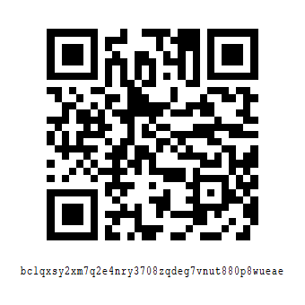

### Project Aurora: Next-Gen Switch 2 Research & Emulation
Welcome to the official repository for Aurora, an experimental, high-performance emulator for the "Switch 2".

#### 🌌 Our Mission
We began work on Aurora nearly a year ago, fueled by the initial hardware leaks and the subsequent documentation of the Tegra T239 chip. Our goal is simple: to ensure the longevity of next-generation gaming through preservation.

#### 🛠 Current State
Aurora is in its early alpha stages. While it can currently boot several low-complexity titles and reach the "Title Screen" on a handful of flagship releases, users should expect significant graphical glitches, unstable framerates, and frequent crashes.
We won't release builds or source code on the internet for now, because it would make some known "ninjas" appear, if you know enough to help us, you know where to find us. Tho we plan to release development blogs soon.

- Core: ARMv8.2-A CPU Recompiler (JIT)
- Graphics: Initial Vulkan 1.4 implementation with preliminary Ray Reconstruction support.
- Kernel: HOS 19.x equivalent syscall mapping.

#### 🛡 Our Philosophy (No Paywalls)
We've watched the emulation scene change over the last few years. We want to be clear about our stance:

- No Patreon: We will never lock builds, features, or compatibility updates behind a monthly subscription.
- No Early Access Paywalls: Every "Nightly" or "Canary" build will be available to the public simultaneously.
- No Commercial Interest: This is a passion project built by the community, for the community.

#### ☕ Support the Effort
Developing for a platform that is still in its infancy is an expensive and time-consuming endeavor. While we don't want a "salary" we do have significant overhead costs, including:

- Hardware Acquisition: Procuring retail units and dev-kits for reverse engineering. We have already fried 17 retails units doing exploit research.
- Exploit Research: Maturing the entry-point exploits required to dump system firmware and game cartridges.

If you appreciate the work we've done over the past year and want to help accelerate the maturity of our dumping tools and emulator core, we accept donations via Bitcoin. Your support helps us buy the hardware we eventually have to break to make this software possible.

#### Bitcoin (BTC) Address:
bc1qxsy2xm7q2e4nry3708zqdeg7vnut880p8wueae

#### ⚠️ Disclaimer & Legal
Aurora is not affiliated with any console manufacturer.
We do not provide firmware, system keys, or game files.
You must legally dump your own games and keys from your own hardware.

Emulation is a legal right for the purposes of preservation and interoperability; however, piracy is not condoned.

"The best way to predict the future is to emulate it."
